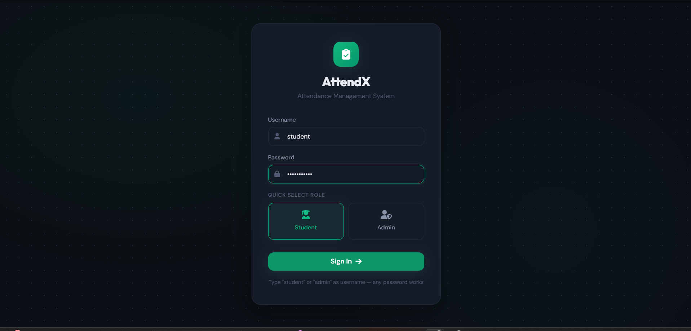
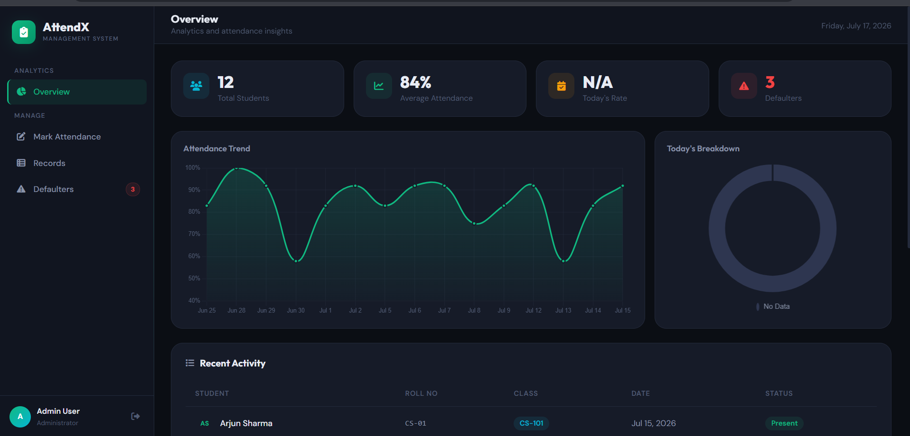
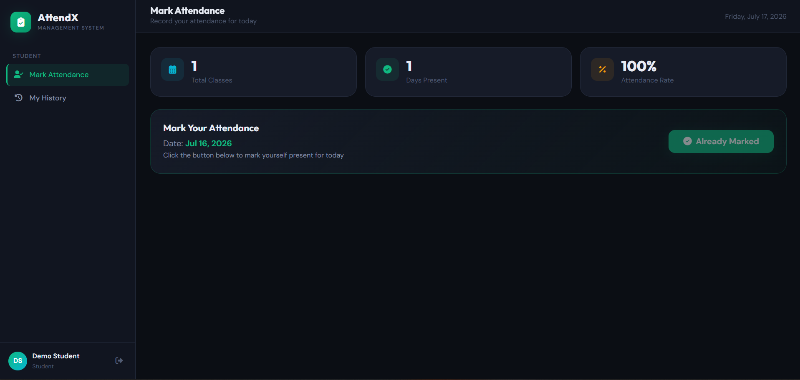
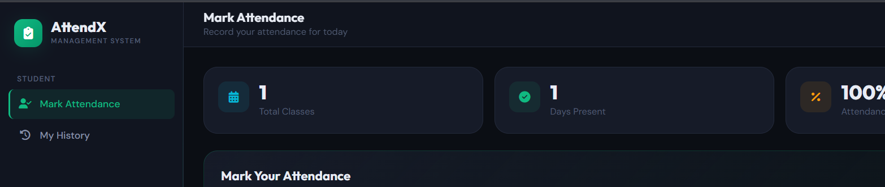
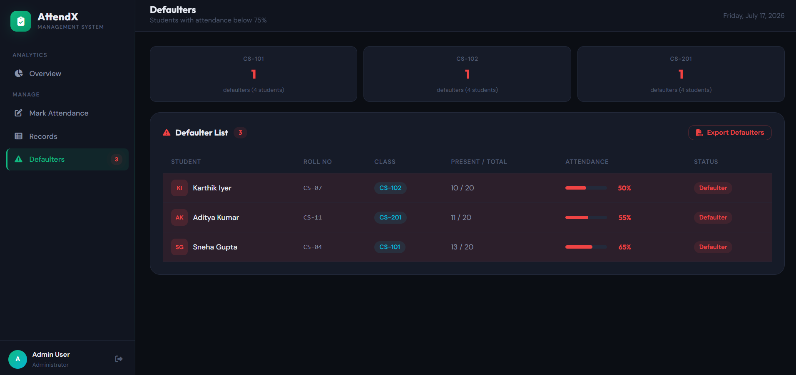

# 📚 Advanced Attendance Management System (Modular Edition)

A responsive, component-driven **Attendance Management System** built using **HTML5**, **CSS3**, and **Vanilla JavaScript**, featuring a fully automated **Continuous Integration and Continuous Deployment (CI/CD)** pipeline powered by **GitHub Actions**, **AWS EC2**, and **Apache2**.

This project demonstrates modern frontend development, modular application architecture, cloud deployment, and DevOps automation by automatically deploying every code update from GitHub to a production AWS EC2 server.

---

# 📸 Project Preview

## 🔐 Login Page

<p align="center">
  
</p>

---

## 👨‍💼 Admin Dashboard

<p align="center">
  
</p>

---

## 👨‍🎓 Student Dashboard

<p align="center">
  
</p>

---

## ✅ Attendance Marking

<p align="center">
  
</p>

---

## ⚠️ Defaulter Analytics

<p align="center">
  
</p>

# 🚀 Project Overview

The application provides separate interfaces for **Students** and **Administrators**, allowing students to mark attendance while enabling administrators to monitor attendance records, identify attendance defaulters, and export attendance reports.

Beyond the application itself, this project demonstrates an industry-standard DevOps workflow where every code push automatically deploys the latest version to an AWS EC2 production server without any manual intervention.

---

# 🏗️ System Architecture

```text
Developer (Local Machine)
        │
 git add / commit / push
        │
        ▼
GitHub Repository
        │
        ▼
GitHub Actions
(CI/CD Workflow)
        │
 Secure SSH + Rsync Deployment
        │
        ▼
Amazon EC2 (Ubuntu Server)
        │
        ▼
Apache2 Web Server
        │
        ▼
Attendance Management System
```

---

# ✨ Features

## 👨‍🎓 Student Module

- Student Login
- Mark Daily Attendance
- Attendance stored using Local Storage
- Prevent duplicate attendance
- Responsive dashboard

---

## 👨‍💼 Admin Module

- Admin Login
- View attendance records
- Attendance history
- Student attendance monitoring
- Attendance statistics

---

## 📊 Attendance Analytics

- Automatic defaulter detection
- Flags students below **75% attendance**
- Attendance summary generation

---

## 📁 Export Module

- Export attendance records
- CSV download support
- Spreadsheet-compatible reports

---

## 🎨 Modern User Interface

- Fully responsive layout
- Modular CSS architecture
- Reusable UI components
- Mobile-friendly design

---

# 💻 Technology Stack

## Frontend

- HTML5
- CSS3
- JavaScript (ES6)
- Local Storage API

## DevOps

- Git
- GitHub
- GitHub Actions
- SSH
- Rsync

## Cloud Infrastructure

- Amazon EC2
- Ubuntu Server
- Apache2 Web Server

---

# 📂 Project Structure

```text
attendance-management-system/

│
├── assets/
│   └── dashboard.png
│
├── .github/
│   └── workflows/
│       ├── deploy.yml
│       └── main.yml
│
├── css/
│   ├── base.css
│   ├── variables.css
│   ├── layout.css
│   ├── components.css
│   ├── views.css
│   └── style.css
│
├── js/
│   ├── app.js
│   ├── api.js
│   ├── auth.js
│   ├── dashboard.js
│   ├── attendance.js
│   ├── records.js
│   ├── defaulters.js
│   ├── export.js
│   ├── utils.js
│   └── script.js
│
├── index.html
├── dashboard.html
└── README.md
```

---

# ⚙️ Application Workflow

```text
Student/Admin Login
          │
          ▼
Role Authentication
          │
     ┌────┴────┐
     │         │
     ▼         ▼
 Student      Admin
     │         │
     ▼         ▼
Mark Attendance   View Records
     │         │
     ▼         ▼
Local Storage  Analytics
     │
     ▼
CSV Export
```

---

# 🚀 Automated CI/CD Pipeline

The deployment process is fully automated using GitHub Actions.

1. Developer makes changes locally.
2. Changes are committed and pushed to GitHub.
3. GitHub Actions automatically starts the deployment workflow.
4. Secure SSH authentication is established using GitHub Secrets.
5. Project files are synchronized to the AWS EC2 instance using Rsync.
6. Apache2 immediately serves the updated application.

No manual deployment or FTP uploads are required.

---

# 🔐 Secure Deployment

Deployment credentials are securely managed using GitHub Actions Secrets.

Required repository secrets:

| Secret | Description |
|---------|-------------|
| EC2_HOST | Public IPv4 address of EC2 |
| EC2_USERNAME | Ubuntu |
| EC2_SSH_KEY | Private SSH Key (.pem contents) |

---

# ⚙️ Server Configuration

Install Apache on the EC2 instance:

```bash
sudo apt update
sudo apt install apache2 -y
sudo chown -R ubuntu:ubuntu /var/www/html
```

---

# 🎯 Skills Demonstrated

- HTML5
- CSS3
- JavaScript (ES6)
- Modular Frontend Architecture
- Responsive Web Design
- Local Storage API
- Git
- GitHub
- GitHub Actions
- CI/CD Pipeline
- AWS EC2
- Apache2
- SSH Deployment
- Rsync
- DevOps Fundamentals
- Cloud Deployment

---

# 🚀 Future Enhancements

- Backend Integration (Node.js / Spring Boot)
- MySQL Database
- JWT Authentication
- QR Code Attendance
- Face Recognition Attendance
- AWS RDS Integration
- Docker Containerization
- Nginx Reverse Proxy
- HTTPS using Let's Encrypt
- AWS Load Balancer
- CloudWatch Monitoring

---

# 📚 Learning Outcomes

This project demonstrates practical experience with:

- Modular Frontend Development
- Component-Based CSS Architecture
- JavaScript Application Design
- Attendance Analytics
- CSV Export Functionality
- Git Version Control
- AWS EC2 Deployment
- Apache Web Server Configuration
- GitHub Actions CI/CD
- Secure SSH Deployment
- Production Deployment Automation

---

# 👨‍💻 Author

**Nikhil Fegade**

Computer Engineering Student

**AWS | DevOps | Cloud Computing | JavaScript | Frontend Development**
